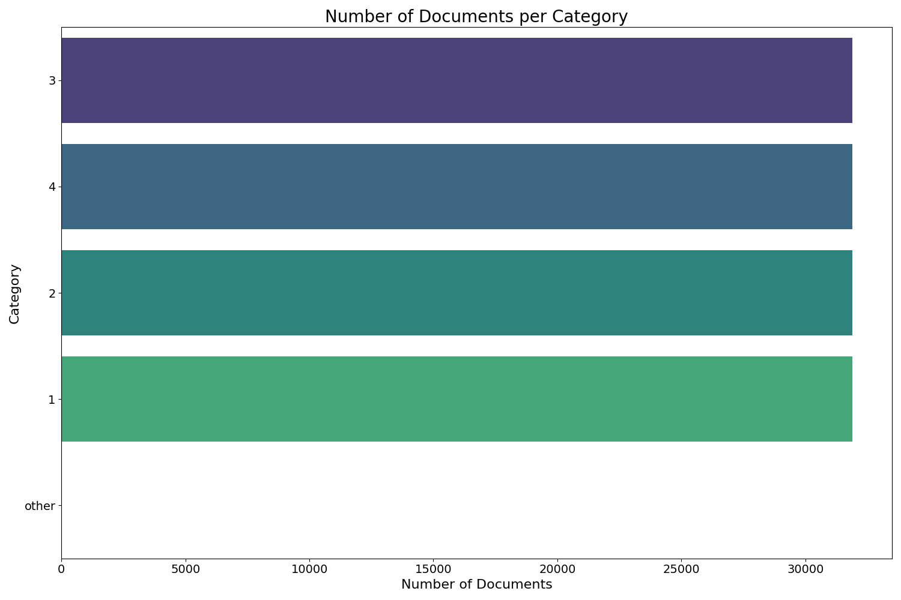

# Article Classifier Pipeline

## Introduction
This project, "Article Classifier Pipeline," began as a weekend fun activity to showcase abilities in PyTorch and text data problems. It evolved into a demonstration of general understanding of machine learning pipelining. The final product is an application that classifies an article into one of four categories: Business, Sports, World, Sci/Tech.

## Pipeline Overview
The pipeline consists of the following steps:
1. **Retrieve the Data**
2. **Exploratory Data Analysis (EDA)**
3. **Data Preprocessing**
4. **Model Training**
5. **Model Deployment**
6. **Model Monitoring**

Each step is implemented in the `pipeline_steps` directory and is prefixed with `step{step_index}`.

### 1. Retrieve the Data
Using the AGNews dataset from PyTorch:
```python
train_iter, test_iter = AG_NEWS()
```

### 2. EDA
- **Labels**: 4 (1: World, 2: Sports, 3: Business, 4: Sci/Tech)
- **Distribution**: Evenly distributed across labels
- **Document Length**: Mostly around 40 words

**Class Distribution:**


**Number of Words Distribution:**


**Data Description:**
```
------------------------
Total Documents: 127600
------------------------

            label      num_words
count  127600.000000  127600.000000
mean        2.500000      37.840000
std         1.118038      10.087912
min         1.000000       8.000000
25%         1.750000      32.000000
50%         2.500000      37.000000
75%         3.250000      43.000000
max         4.000000     177.000000
```

**Sample Documents:**
<details>
  <summary>Click to expand</summary>

  ```
Sample Documents:
   label                                               text  num_words
0      3  Wall St. Bears Claw Back Into the Black (Reute...         21
1      3  Carlyle Looks Toward Commercial Aerospace (Reu...         36
2      3  Oil and Economy Cloud Stocks' Outlook (Reuters...         36
3      3  Iraq Halts Oil Exports from Main Southern Pipe...         36
4      3  Oil prices soar to all-time record, posing new...         37
------------------
Sample Texts:
World Failed Bhopal Gas Victims, Says Amnesty London, Nov. 30 (NNN) : The world has failed to help survivors of the Bhopal gas leak in India 20 years ago or to punish the guilty, Amnesty International has said.
------------------
Huawei wins 3G contract from Telfort Huawei Technologies, China #39;s leading telecommunications equipment maker, will build a third-generation network for Telfort, the Dutch mobile operator, its first such contract in Europe.
------------------
Wheel Woes For Mars Rover (AP) PASADENA, Calif. (AP)  The Mars rover Spirit has developed a problem with one of its six wheels, but NASA officials said Tuesday they believe the robot geologist can continue working.
------------------
Martyn continues his run feast Damien Martyn has made it back to back centuries against India as Australia looked to build a big first innings total in the third Test in Nagpur.
------------------
Olympic joy in Greek, Chinese press Newspapers in Greece reflect a mixture of exhilaration that the Athens Olympics proved successful, and relief that they passed off without any major setback.
------------------
Australian PM, Challenger in Dead Heat (AP) AP - Prime Minister John Howard and his Labor Party challenger were in a virtual dead heat on the eve of parliamentary elections, with Australians focusing on the economy and social programs more than Howard's decision to send troops to Iraq.
------------------
Dutch arrest man suspected of aiding Saddam war crimes, genocide (AFP) AFP - The Dutch police said they had arrested a man suspected of aiding former Iraqi leader Saddam Hussein in committing war crimes and genocide by supplying him with the materials to make chemical weapons used in attacks in the 1980s.
------------------
Video Claims Threat to Japanese Hostage's Life Video posted Tuesday on a militant Islamic Web site showed what it claimed was a Japanese captive kidnapped by Abu Musab al-Zarqawi's group and threatened to behead him within 48 hours unless Japan pulls its troops from Iraq.
------------------
Cabinet ministers suspended after Congo's parliament alleges corruption (Canadian Press) Canadian Press - KINSHASA, Congo (AP) - President Joseph Kabila suspended six cabinet ministers and 10 directors of state-run companies Thursday after a parliamentary inquiry alleged they had embezzled government funds.
------------------
UN nuclear watchdog hails Tripoli UN inspectors praise Libya for its co-operation in revealing details of its dismantled atomic weapons programme.
------------------
  ```
</details>

### 3. Data Preprocessing
- **Tokenization**: Using torch's "basic_english" tokenizer.
- **Token Embeddings**: Convert tokens to 100-dimensional GloVE embeddings. 
- **Article Embeddings**: Average all the tokens for an article into a single embedding representing the entire article
- **Label Conversion**: Convert labels to one-hot vectors. Example: label 3 (Business) becomes [0, 0, 1, 0]

### 4. Model Training
Architecture: ANN with one hidden layer, dropout, and ReLU activation. Softmax for the output  
Notes: The code could be improved to make architecture more configurable:  

```python
class TextClassifier(nn.Module):
    def __init__(self, embedding_dim=100, num_classes=4):
        super(TextClassifier, self).__init__()
        self.fc1 = nn.Linear(embedding_dim, 200)
        self.relu = nn.ReLU()
        self.dropout = nn.Dropout(0.5)
        self.fc2 = nn.Linear(200, num_classes)
        self.softmax = nn.Softmax(dim=1)
```
Though learning rate, batch_size and num_epochs are configurable
```python
class ModelTrainer(PipelineNode):
    def __init__(self, model=TextClassifier(), learning_rate=0.001, batch_size=128, num_epochs=20)
```
**Training Statistics:**


After Training Completes, the model is saved as a file.  

### 5. Model Deployment
- **Endpoint**: Flask `/predict` route - takes in a list of "texts", returns a list of string categories.
- **Dockerization**: Built into a Docker image, runs on port 5000.

### 6. Model Monitoring
- Local script for basic monitoring  - periodically invoke the `/predict` route and assert the returns.
- Future improvements: Randomized data, tracking accuracy, response times, etc.

## Running the Application
From the project root directory:
```
pip install -r requirements.txt
python article-classifier-pipeline.py
```
